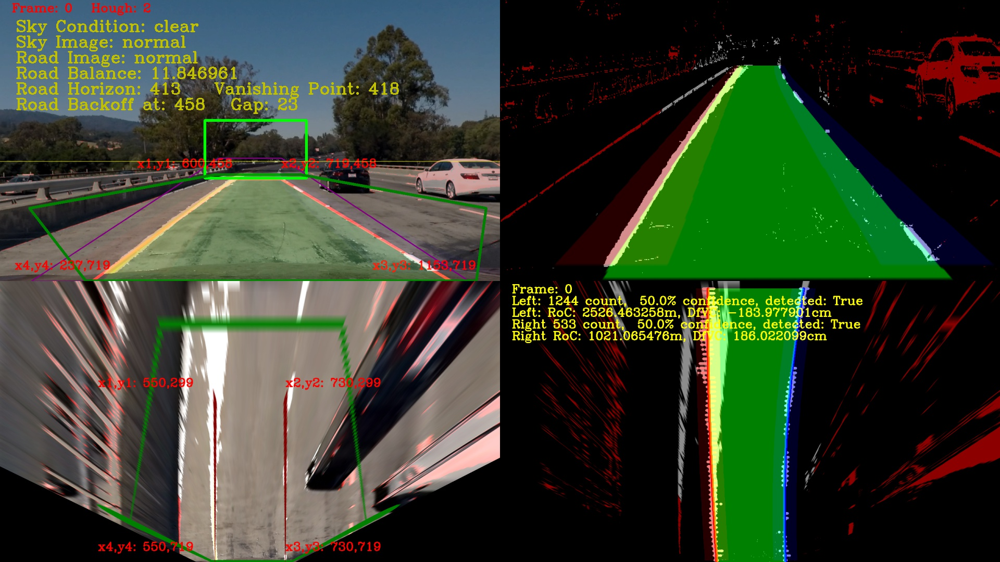

SDC-P4
======
Udacity Self-Driving Car Project 4: Advanced Lane Finding


Use OpenCV to create a software pipeline to identify the lane boundaries in video from a front-facing camera on a car.

SDC-P4 is a command line interface (CLI) software written in python that is structured internally as a software pipeline, a series of software components, connected together in a sequence or multiple sequences (stages), where the output of one component is the input of the next one.  The majority of its software is based on the Open Source Computer Vision Library (OpenCV).  OpenCV is an open source computer vision and machine learning software library. OpenCV was built to provide a common infrastructure for computer vision applications and to accelerate the use of machine perception in the commercial products.  More about OpenCV can be found at http://opencv.org/.  More details about this pipeline implementation can be found [here](./README-PROJECT-DETAILS.md)

## Installation

This project uses python 3.5.2.  Clone the GitHub repository, and use Udacity [CarND-Term1-Starter-Kit](https://github.com/udacity/CarND-Term1-Starter-Kit) to get the rest of the dependencies.

```
$ get clone https://github.com/diyjac/SDC-P4.git
```

## Usage

As explained earlier, SDC-P4 is a python based CLI.  You list options by using `--help`:

```
$ python P4pipeline.py --help
usage: python P4pipeline.py [options] infilename outfilename

DIYJACs Udacity SDC Project 4: Advanced Lane Finding Pipeline

positional arguments:
  infilename   input image or video file to process
  outfilename  output image or video file

optional arguments:
  -h, --help   show this help message and exit
  --diag DIAG  display diagnostics: [0=off], 1=filter, 2=proj 3=full
  --notext     do not render text overlay
```

To process an image or a video using this pipeline, use this format:

```
$ python P4pipeline.py <inputfile> <outputfile>
```

The following is an example run:

```
$ python P4pipeline.py test_images/test1.jpg output_images/test1.jpg
```

And produces this output:


You may also wish to use the diagnostics mode and see how the pipeline process the images internally.  The following `--diag=1` option turns on image filter diagnostics:

```
$ python P4pipeline.py --diag=1 test_images/test1.jpg output_images/test1diag1.jpg
```

will produce this image:


Use the `--diag=2` option to invoke the **ProjectionManager** diagnostics as shown here:

```
$ python P4pipeline.py --diag=2 test_images/test1.jpg output_images/test1diag2.jpg
```

will produce this image:



Use the `--diag=3` option to invoke the **Full Diagnotics Mode** as shown here:

```
$ python P4pipeline.py --diag=3 test_images/test1.jpg output_images/test1diag3.jpg
```

will produce this image:


## Contributing

No futher updates nor contributions are requested.  This project is static.

## License

SDC-P4 results are released under [MIT License](./LICENSE)
